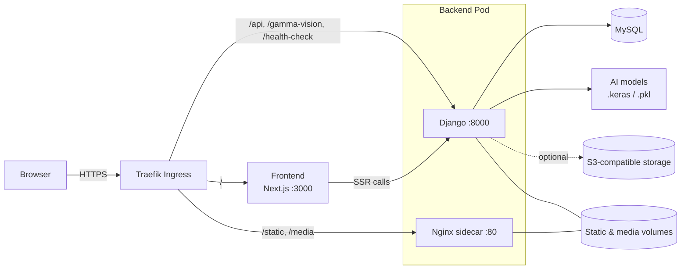
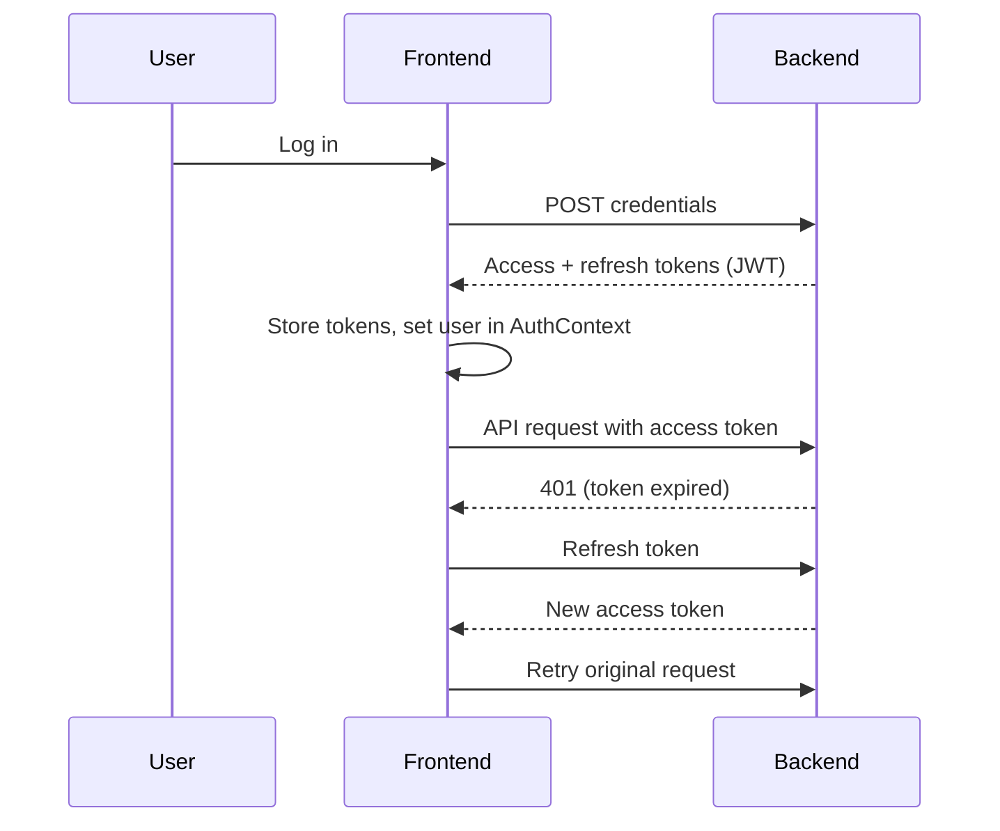
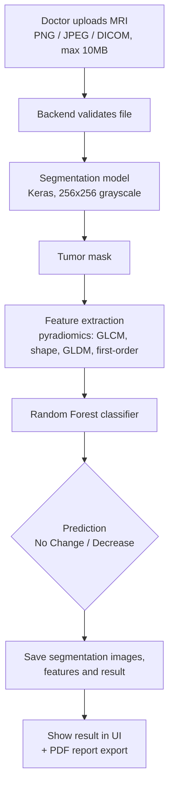
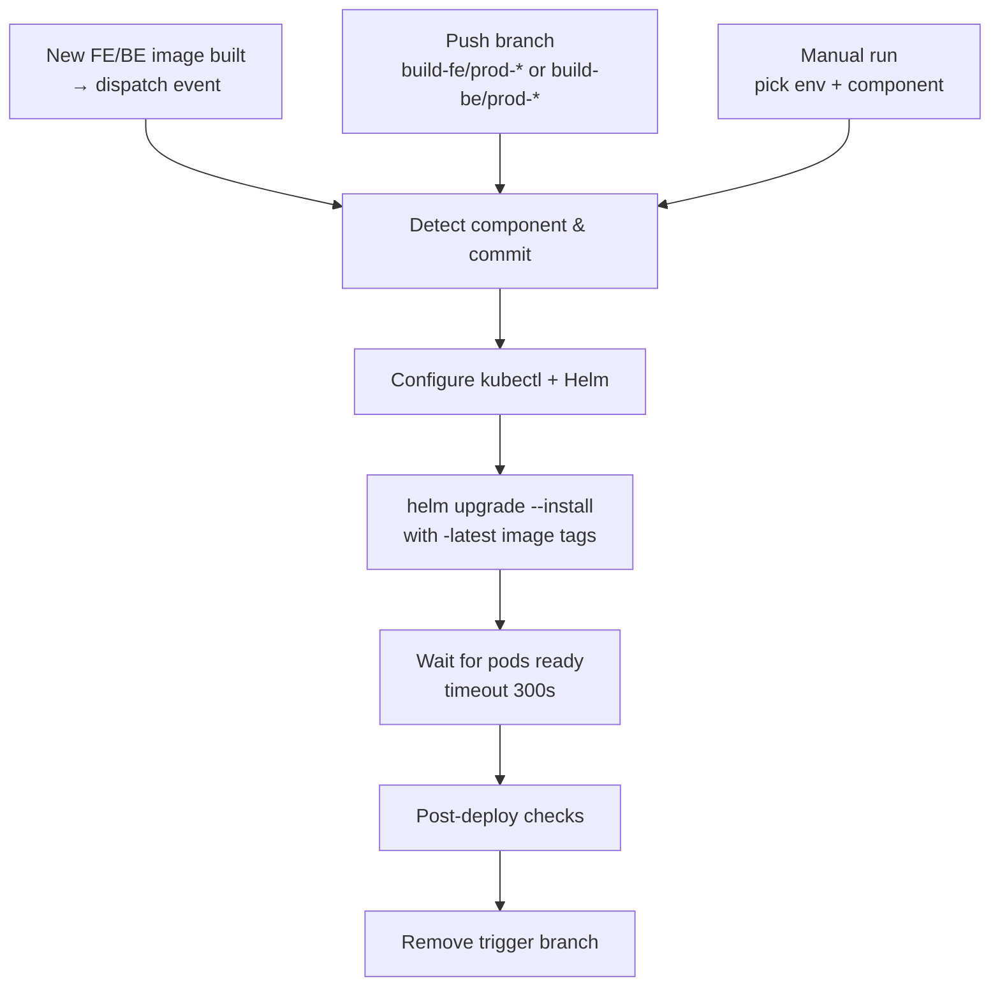
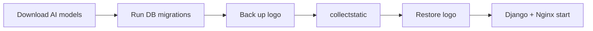

# GammaVision

GammaVision is a web platform that helps doctors analyze brain MRI scans. A doctor uploads a scan, the system finds the tumor region with a deep learning model, extracts radiomic features from it, and predicts how the tumor is likely to progress. Each result is saved to the patient's record and can be exported as a PDF report.

The system has three parts:

| Component | Role | Stack |
|-----------|------|-------|
| **Frontend** | Web app for doctors and patients | Next.js 15, React 19, TypeScript, Tailwind, shadcn/ui |
| **Backend** | REST API, authentication, AI inference | Django 5.2, DRF, TensorFlow/Keras, scikit-learn, pyradiomics, MySQL 8 |
| **Helm chart** | Kubernetes packaging and deployment | Helm 3, K3s, Traefik, cert-manager |

---

## Architecture



- **Frontend** renders the UI and talks to the backend over `/api/v1/`. In the cluster, server-side rendering calls the backend service directly; the browser goes through the ingress.
- **Backend pod** runs two containers: Django handles the API and inference, and an Nginx sidecar serves static and media files from shared volumes, so Django doesn't have to.
- **Database** is MySQL, with its own chart and persistent volume.

---

## How the System Works

### 1. Authentication



Sessions persist across page reloads. Permissions depend on the role: only doctors can run predictions, and patients can only see their own data.

### 2. MRI Analysis



The AI models load the first time a prediction is requested, and only once, even under concurrent requests. After that they stay in memory.

### 3. Data Model

```
Hospital → Doctor → Patient → MRI Image → Prediction
                                              ├── Segmentation images
                                              ├── Radiomic features (JSON)
                                              └── PDF report
```

---

## Deployment

The app runs on a K3s cluster. An umbrella Helm chart (`gammavision`) pulls in three sub-charts, **database**, **backend** and **frontend**, and defines the ingress with TLS from Let's Encrypt. Each environment (dev, staging, prod) has its own values file. Secrets such as the Django keys, the DB passwords and the model-download token are passed at deploy time and never committed.

### Deployment Pipeline



### Backend Pod Startup

Before Django starts, init containers prepare the pod in this order:



This ensures the models are present, the schema is up to date, and the static files in the shared volume match the current image.

### Scaling

| Service | Replicas | Scale-up trigger |
|---------|----------|------------------|
| Frontend | 1–4 | 60% CPU |
| Backend | 1–3 | 70% CPU |

A minimal production setup needs about 4–6 GiB of RAM and 2 vCPUs. For a K3s node with room for auto-scaling, 4 vCPU and 8 GB of RAM is recommended.

---

## Security Notes

- JWT access/refresh tokens, role-based endpoint permissions
- CORS restricted to known frontend origins
- Containers run as non-root
- TLS on all public traffic
- Nginx adds security headers and blocks hidden files (`.env`, `.git`, …)
- Uploads are limited by size and file type
